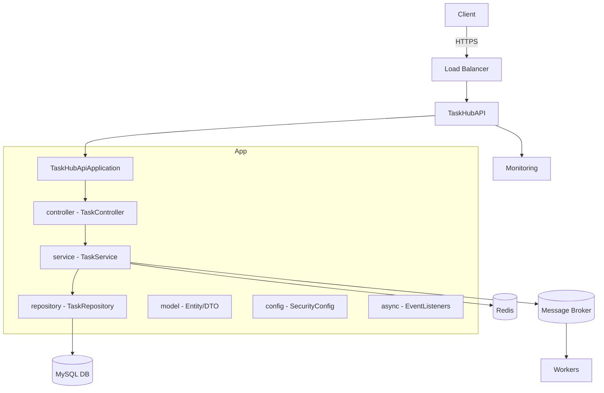

```mermaid
graph TD
  A[Client] -->|HTTPS| B[Load Balancer]
  B --> C[TaskHubAPI]

  subgraph App
    C1[TaskHubApiApplication]
    C2[controller - TaskController]
    C3[service - TaskService]
    C4[repository - TaskRepository]
    C5[model - Entity/DTO]
    C6[config - SecurityConfig]
    C7[async - EventListeners]
  end

  C --> C1
  C1 --> C2
  C2 --> C3
  C3 --> C4

  C4 --> D[(MySQL DB)]
  C3 --> E[(Redis)]
  C3 --> F[(Message Broker)]
  F --> G[Workers]

  C --> H[Monitoring]
```
