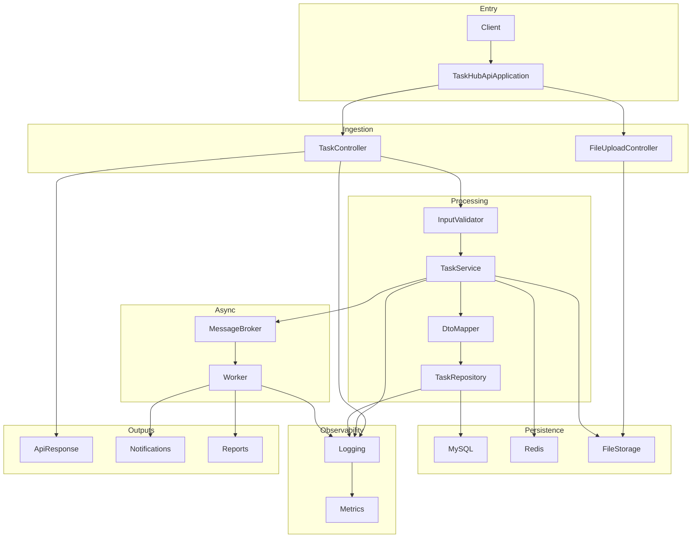

```mermaid
graph TD

  subgraph Entry
    Dev[Client]
    App[TaskHubApiApplication]
  end

  subgraph Ingestion
    TaskAPI[TaskController]
    FileAPI[FileUploadController]
  end

  subgraph Processing
    Validator[InputValidator]
    TaskSvc[TaskService]
    Mapper[DtoMapper]
    Repo[TaskRepository]
  end

  subgraph Persistence
    DB[MySQL]
    Cache[Redis]
    FileStore[FileStorage]
  end

  subgraph Async
    Broker[MessageBroker]
    Worker[Worker]
  end

  subgraph Observability
    Logs[Logging]
    Metrics[Metrics]
  end

  subgraph Outputs
    APIResp[ApiResponse]
    Notifs[Notifications]
    Reports[Reports]
  end

  Dev --> App
  App --> TaskAPI
  App --> FileAPI

  TaskAPI --> Validator
  Validator --> TaskSvc
  TaskSvc --> Mapper
  Mapper --> Repo
  Repo --> DB

  FileAPI --> FileStore
  TaskSvc --> FileStore

  TaskSvc --> Cache
  TaskSvc --> Broker
  Broker --> Worker

  TaskAPI --> APIResp
  Worker --> Notifs
  Worker --> Reports

  TaskAPI --> Logs
  TaskSvc --> Logs
  Repo --> Logs
  Worker --> Logs

  Logs --> Metrics
```
